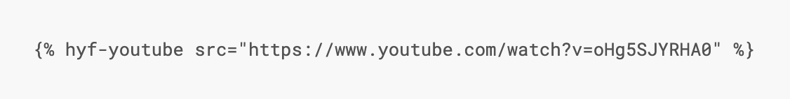
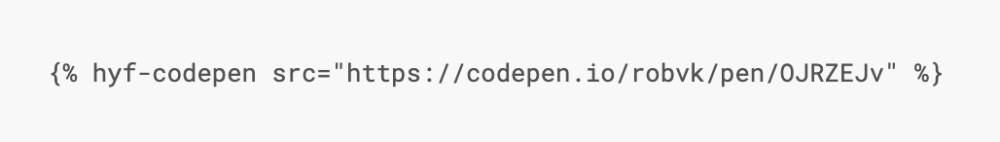
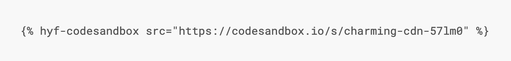

## Contributing

First of all, thanks for considering to help keep this study book effective and up to date. There are quite a few ways to help and as usual all help is welcome. Thanks for being a part of this community.

This book is hosted on the HackYourFuture repository [here](https://github.com/HackYourFuture/study). When browsing the gitbook there is also a link at the top to get to that page to immediately make a PR there.

### Link management
There is a huge amount of information on the internet and we will be linking to many videos / articles / code / guides. To keep this manageable we appreciate the following feedback:

* Do you know a resource we have missed?  Send a PR with the link. We will check it out and add it!
* Was a certain link super helpful? Send us a PR with a `+` after the link.  The more `+` the more helpful!
* Was a link not very helpful, or even confusing? Send us a patch with a `-` after the link. If a link has too many `-` and not enough `+`, we'll remove it.
* All good things come to an end. If you find a link that has gone dead, send us a Patch with a `X` after the link.

### Adding a programming topic
There is a template (`./template-topic.md`) in the repo that can be used to add a new topic. To explain a concept we use the 4 E's system: Essence > Explanation > Example > Exercise:

First we want to introduce the *essence* of the concept. A concise indication what the concept is about and why it is important.

Then we the *explain* the concept in depth. Add text, images, feel free to embed a video here as well (or make your own). 

After that, we want to show an *example* of the concept in action, embed some code. Try to get it as close to a real world situation as possible.

Lastly, it is time to let the student practice the concept with some *exercises*. There are never too many exercises, but try to order them on difficulty, with the easiest first.

Try to embed as much as possible onto the page, we want to keep them focused on the topic at hand and not clicking different links in different tabs.

#### Embedding images
Make sure to upload the image to the repository and not link to an external site.

#### Example code
If you want your example code to be highlighted in javascript and get trigger the HYF code plugin add `js` to the code block. As follows:

```js
const wowString = 'cool stuff';
```

#### Embedding a video
To embed a video use the following code:





#### Embedding simple html pages
For simple html pages we prefer codepen. The url needs to be the embed url (replace /pen/ with /embed/). You can embed it using the following code:





#### Embedding projects with multiple files
Codesandbox is quite large, so only when you have multiple files should it be used. Check out the other sections for other options. To embed a codesandbox you can use the following code with a link to the url:





