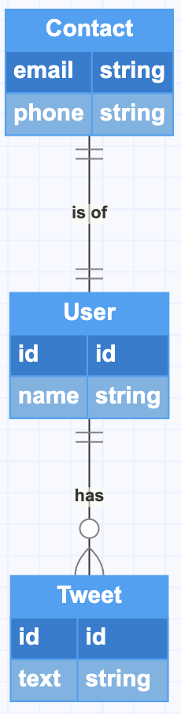

# Normalized vs Embedded

We have already learned that document-based databases allow pretty much anything to be stored inside them. That does not mean that there is no structure to this data however. There are two common ways of organising your data, being the `Normalized` way and the `Embedded` way. Let's look at the following example ERD and see how to save this in both ways:



So very basic, we have `users` who have an id, a name, and they can have 0 or more `tweets` where a tweet has a text. And then we have `contacts` that store contact information for our `users`.

## Normalized

You may recognize the term normalization from the [SQL part of the curriculum](../../sql/normalization.md) where it is absolutely the way to go when storing data. We can do the same in mongodb, so if we look at our users and tweets diagram we can say that we would have 3 `collections`: `users`, `contacts` and `tweets`. So with some sample data our stored objects would be:

```js
// The Users collection
const users = [
  {
    id: "ObjectId1",
    name: "Kim",
    tweets: ["ObjectId2"],
  },
  {
    id: "ObjectId3",
    name: "Dwayne",
    tweets: ["ObjectId4"],
  },
];

// The Tweets collection
const tweets = [
  {
    id: "ObjectId2",
    text: "Selfies and Cereal kind of day",
  },
  {
    id: "ObjectId4",
    text: "Thanks for making this punk kid's football dreams come true",
  },
];

const contacts = [
  {
    id: "ObjectId5",
    email: "kim@kardashian.com",
    phone: "0123456789",
    userId: "ObjectId1",
  },
  {
    id: "ObjectId6",
    email: "the@rock.com",
    phone: "0123456789",
    userId: "ObjectId3",
  },
];
```

As you can see this way of storing data is similar to SQL, you have `collections` and via the ids there is a link between them. This is all your own responsibility though, there is no such thing as keys in mongodb that will do any verification. If a user is deleted for example you have to ensure that any contact information or tweets is deleted as well.

Let's look at the embedded version and then think about the advantages/disadvantages.

## Embedded

Embedding (or denormalization) is when you embed the data inside the main document. It is best to explain using our example:

```js
// The Users collection
const users = [
  {
    id: ObjectId("507f191e810c19729de860ea"),
    name: "Kim",
    contact: {
      email: "kim@kardashian.com",
      phone: "0123456789",
    },
    tweets: [
      {
        id: ObjectId("876f191e810c19729de86123"),
        text: "Selfies and Cereal kind of day",
      },
    ],
  },
  {
    id: ObjectId("302f191e810c19729de8641e"),
    name: "Dwayne",
    contact: {
      email: "the@rock.com",
      phone: "0123456789",
    },
    tweets: [
      {
        id: ObjectId("5977aad83abbae8aef44b477"),
        text: "Thanks for making this punk kid's football dreams come true",
      },
    ],
  },
];
```

As you can see we only have one collection now and all the tweets and contact information is embedded into the users collection. Either way, by having complex fields (objects or arrays) inside of a collection you are `embedding` that information.

## When to use what?

So obviously the question now arises about when you should use which type of data storage. The most important thing to keep in mind is to avoid data duplication as much as possible. So if two collections already need to share the data you will go for the normalised approach. Otherwise these are the things to consider:

- Embedding data allows for faster reads as you don't need to do multiple queries in multiple collections
- Normalising data allows for faster writes as your documents will be smaller
- Normalising data allows for easier growth of your data structure as it is easier to expand a collection that is not as complex
- Embedding is good if the subdocument is small and is always only linked to that object.

So looking over our example we would say that our `contact` information should probably be embedded. It is small, will probably not grow a lot in size and is closely linked to the user.

The `tweet` information should probably be a separate collection though as there will be a lot of them and we will probably be adding a lot of features to it (likes, retweets, replies, etc) which means a lot of writes.

# Extra reading

If you just can't get enough, here are some extra links that mentors/students have found useful concerning this topic:

- [Normalization vs Denormalization](https://dev.to/damcosset/mongodb-normalization-vs-denormalization#:~:text=What%20is%20normalization%3F,multiple%20documents%20will%20reference%20it.)
