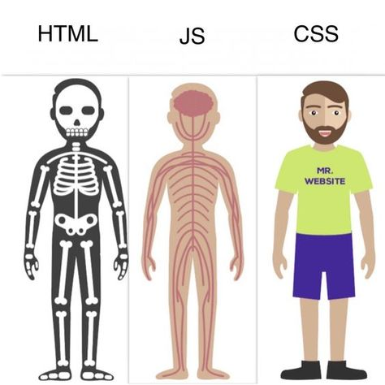

# What is JavaScript?
JavaScript is a programming language. We use it to communicate with the browser, software that allows us to access the Internet and open webpages. It is essential to learn in order to become a web developer.

You've already learned what HTML and CSS do. Javascript is the third part that makes the circle complete. If we liken the three to the human body, we could say that HTML provides the skeleton with all the basic content, CSS makes the skin/shape to determine the look, and JavaScript is the brain and muscles to allow for interactivity.

The main use for JavaScript is to make your webpage interactive: for example, if you click a button it will open a popup. Or if you scroll over an image, it changes its color.





# Extra reading
If you just can't get enough, here are some extra links that mentors/students have found useful concerning this topic:

## Introduction links
* ["Intro" from __JavaScript.info__](https://javascript.info/intro)
* ["What is JS" from __MDN__](https://developer.mozilla.org/en-US/docs/Learn/JavaScript/First_steps/What_is_JavaScript)
* [5 computer language fundamentals](https://blog.upperlinecode.com/computer-language-fundamentals-five-core-concepts-1aa43e929f40)
* [Hello World](https://javascript.info/hello-world) (js.info)
* [code structure](https://javascript.info/structure) (js.info)

## Awesome Tutorials

* They're all good, pick your favorite and go for it!
* Looking for even more? Check out [Awesome JavaScript Learning](https://github.com/micromata/awesome-javascript-learning)

## Not Videos

* [LaunchCode](https://education.launchcode.org/intro-to-professional-web-dev/index.html)
* [Programiz](https://www.programiz.com/javascript)
* [JavaScript for Everyone](https://github.com/Asabeneh/JavaScript-for-Everyone)
* [30 Days of JavaScript](https://github.com/Asabeneh/30DaysOfJavaScript)
* RithmSchool: [JS part 1](https://www.rithmschool.com/courses/javascript), [JS part 2](https://www.rithmschool.com/courses/intermediate-javascript/)
* [Introduction to JavaScript](https://github.com/nerdschoolbergen/introduction-to-javascript)
* dinanathsj29: [Tutorial](https://github.com/dinanathsj29/javascript-beginners-tutorial), [Exercises](Javhttps://github.com/dinanathsj29/javascript-exercise-beginners)
* [FreeCodeCamp](https://www.freecodecamp.org), [JavaScript in 3 Hours](https://www.youtube.com/watch?v=PkZNo7MFNFg) & [video series](https://medium.freecodecamp.org/my-giant-javascript-basics-course-is-now-live-on-youtube-and-its-100-free-9020a21bbc27)
- [Introduction to JavaScript Development](https://www.udemy.com/refactoru-intro-js)

## Videos

* [Dev Ed](https://www.youtube.com/watch?v=edlFjlzxkSI&list=PLDyQo7g0_nsX8_gZAB8KD1lL4j4halQBJ)
* mmtuts: [How to Get Started with JS](https://www.youtube.com/watch?v=ItYye9h_RXg&list=PL0eyrZgxdwhxNGMWROnaY35NLyEjTqcgB&index=1)
* Net Ninja: [JS Tutorial For Beginners](https://www.youtube.com/watch?v=qoSksQ4s_hg&list=PL4cUxeGkcC9i9Ae2D9Ee1RvylH38dKuET)
* Mosh: [Learn JavaScript in 1 Hour](https://www.youtube.com/watch?v=W6NZfCO5SIk)
* FreeCodeCamp: [JavaScript Tutorial For Beginners](https://www.youtube.com/watch?v=PkZNo7MFNFg&amp;t=7070s)
* Edureka: [Learn JavaScript - Full Course for Beginners](https://www.youtube.com/watch?v=o1IaduQICO0&t=4461s)
* Caleb Curry: [JavaScript All in one - 9 hours](https://www.youtube.com/watch?v=9M4XKi25I2M&t=13825s)
* Traversy Media: [JavaScript Crash Course For Beginners](https://www.youtube.com/watch?v=hdI2bqOjy3c&t=2003s)
* Great Learning: [JavaScript Tutorial For Beginners - Full Course In 11 Hours ](https://www.youtube.com/watch?v=g1X6b5tRvrw)

### JS References & Text Books:

* [Javascript.info](https://javascript.info) - the best reference for good & quick explanations
    * [JavaScript.info part1](./javascript/Javascript.info-Ebook-Part-1.pdf) (pdf)
    * [JavaScript.info part2](./javascript/Javascript.info-Ebook-Part-2.pdf) (pdf)
* [Eloquent JavaScript](https://eloquentjavascript.net/Eloquent_JavaScript.pdf)
* [Just JavaScript](https://github.com/HackYourFutureBelgium/just-javascript)
* [MDN](https://developer.mozilla.org/en-US/docs/Learn/Getting_started_with_the_web/JavaScript_basics) - where you go to dig deeper
* JS Study Tools: [JS Tutor](http://www.pythontutor.com/live.html#mode=edit), [the devtools](https://developer.mozilla.org/en-US/docs/Tools), VSCode Debugger
* [Beginning JavaScript](./Beginning-JavaScript.pdf) (pdf)
* [JavaScript Data Structure](./JavaScript-Data-Structures.pdf) (pdf)
* [JavaScript the Definitive Guide ](./JavaScript%20The%20Definitive%20Guide.pdf) (pdf)
* [Professional JavaScript](./Professional%20JavaScript.pdf) (pdf)
 
### Other references, tutorials & practice

* [JavaScript Core 1 (CYF)](https://github.com/CodeYourFuture/JavaScript-Core-1-Homework) (practice repo)
* [JS Exercises (CYF)](https://github.com/hackyourfuturebelgium/js-exercises) (practice repo)
* [JavaScript for Cats](http://jsforcats.com) - Fun website with good examples to study.
* Headfirst JavaScript: [PDF](http://wickedlysmart.com/wp-content/uploads/2014/03/Head_First_JavaScript_Programming_SampleChapter.pdf), [GitHub](https://github.com/bethrobson/Head-First-JavaScript-Programming) - very thorough and well-guided introduction.

### writing stylish code:
* [Best Practices](https://github.com/nerdschoolbergen/javascript-best-practices)
* [air bnb style guide](https://github.com/airbnb/javascript)
* Linting: [eslint](https://marketplace.visualstudio.com/items?itemName=dbaeumer.vscode-eslint), [prettier](https://marketplace.visualstudio.com/items?itemName=esbenp.prettier-vscode), [setting them up](https://www.youtube.com/watch?v=YIvjKId9m2c)
* [naming conventions](https://github.com/HackYourFuture/fundamentals/blob/master/fundamentals/naming_conventions.md)
* [code formatting](https://github.com/HackYourFutureBelgium/fundamentals/blob/master/fundamentals/code_formatting.md)
* [special characters](https://github.com/HackYourFuture/fundamentals/blob/master/fundamentals/names_of_special_characters.md)
