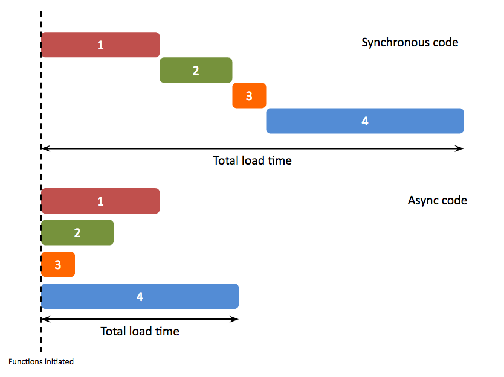

# Asynchronous JS

## Synchronous vs. asynchronous

### Synchronous

In the past you've learned about **control flow**. In short: it's the order in which the computer executes statements in a script. In JavaScript this goes from left to right, top to bottom.

Let's look at code execution from another angle. The program that executes your code can do it in two basic ways: synchronous or asynchronous. Whenever code blocks are executed line after line (from top to bottom) we call this **synchronous execution**. However, when code blocks can be executed **without having to wait until a command ends**, we call this **asynchronous execution**. This is illustrated in the following diagram:

Now imagine the following scenario:

> Noer wants to have breakfast but he doesn't have any food at home. He decides he want to eat oatmeal. The ingredients (oats and milk) can be bought at the supermarket. How to do this? First Noer takes a shower. Then he puts on some clothes. Then some shoes. Then he opens the door and goes outside. Then he jumps on the bike and goes to the closest supermarket. After looking for some time he finds the ingredients. Then Noer buys the ingredients. Then he jump back on the bike and go home. Then he mixes the ingredients and makes oatmeal. Then Noer eats and feels amazing!

In this example, each action could only happen after the previous has been completed. Noer can't put on his shoes, while taking a shower. Or, he can't eat oatmeal while he buys the ingredients.

As you can see, each action is executed in a synchronous manner. This is to say: in a logical order sequentially and only one action at a time.

**This is also how JavaScript by default operates**. Only one operation can happen at a time. If something else wants to start, it has to wait until the current action has finished.

### Asynchronous

Sometimes we want to do multiple things at the same time, without each action to be dependent on each other. Asynchronous execution avoids this bottleneck. You are essentially saying, “I know this function call is going to take a great deal of time, but my program doesn’t want to wait around while it executes.” Consider the following scenario:

> Wouter is feeling hungry, so he decides to go to a restaurant. He arrives there and gets into the line to order food. After ordering he takes a seat and, while he waits, reads a book. Occassionally he looks around and sees different things happening: new people enter the restaurant, some people get their food served and others are just talking. After a short while Wouter's food arrives and it's time to dig in!

In this example Wouter reads a book, but that doesn't affect his meal from being prepared. While his meal is prepared there are other people walking around, eating or just talking with each other. In short: multiple things are happening simultaneously and every event is not dependent upon another.

This does not happen by default in JavaScript, and needs to be invoked. A way to do that is by using `callbacks`, which you'll be learning about in the next section.

### Introducing asynchronicity using callbacks

Imagine the following situation:

> It's 15.00 and you're studying at home for an exam on the next day. Suddenly, your phone rings. You pick up and find it's your best friend! They ask if you'd like to hang out later. What do you do? On the one hand, you'd love to hang out have fun. On the other hand, you really should study some more. You don't know so you tell your friend that you're going to _call back_ later with your answer. You end the conversation and go back to studying. Maybe you take a break or have a snack as well. On the other line your friend hangs up the phone and continues along with their day: they go out grocery shopping, cleaning the house and cooking dinner. After finishing your studies you call your friend and makes plans to go out together.

This example illustrates the concept of **asynchronicity**: there are multiple processes happening simultaneously, without any single thing being dependent upon another. Your friend is not waiting by the phone until you have the answer. Or in technical terms: until the callback (which is you) has the return value (the answer to your friend's request to hang out).

This is the utility of `callbacks`: they allow us to introduce asynchronicity into the control flow of an application.

Study the following resources to learn more about the importance of callbacks:

- [Asynchronous JavaScript](https://www.youtube.com/watch?v=YxWMxJONp7E)
- [Understanding JavaScript Callbacks](https://www.youtube.com/watch?v=Nau-iEEgEoM)
- [Callback Functions](https://www.youtube.com/watch?v=QRq2zMHlBz4)

