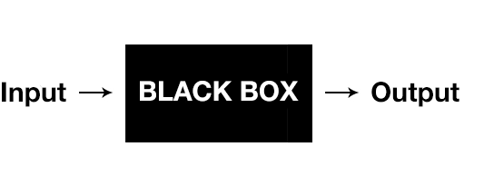

# Functions

In programming, we often use code to perform a specific task multiple times. Instead of rewriting the same code, we can group a block of code together and associate it with one task. This is useful, because then we can reuse that block of code whenever we need to perform the task again.

In JavaScript, we call these blocks of code `functions`. They are written like this:

```js
function multiplyTwoNumbers(number1, number2) {
  return number1 * number2;
}
```

This example is a `function definition`; a function is being defined. Let's examine it closer.

The first word, `function`, is a keyword, that indicates that what will follow is a function definition. The word `multiplyTwoNumbers` is the name of the function, that will be referred to when the function needs to be executed.

> Note: This is a common pattern you'll find across different programming languages. It's usually necessary to specify what type of data you are going to create, before creating it. This is necessary because they computer cannot guess how they should treat any piece of information. It would the same as, before you ask a question to someone, you would say: QUESTION, what is a function? Saying QUESTION before you ask a question informs the interpreting party (i.e. the person you're talking to) that what you just said is a question. In human communication that's usually not necessary, but it is when communicating with computers.

The words `number1` and `number2` are called `parameters`: they work as a temporary placeholder that will be replaced with real data.

You can liken it to how in a restaurant a table is reserved for customers. The moment the customers arrive the placeholders will be removed and the seats will be filled by the actual customers.

The moment a function is given an input, the parameters are replaced by that input. Each input is called an `argument`.

When used in software, a function is like a black box that:

1. Receives an input
2. Performs an operation on the input (inside the box)
3. Produces an output.



A function is used as follows:

```js
multiplyTwoNumbers(2, 4);
```

You refer to the function name, give it arguments (which are either supplied by some other code or created on the spot) and get back an output. The output is also called the `return value`, the information you get next to the `return` keyword.

As a developer you either use pre-defined functions (usually called `methods`) or create your own in order to make certain tasks happen. Within a function block (which is everything between the `{ }`, there are instructions that tell it in what ways it should manipulate and change the input in order to produce a desired output.

You should see it like this: a function is like a `tool` in the tool box. Only, instead of a hammer or a screwdriver you have a function that multiplies two numbers, or a function that transform data from one data type to another.

If you prefer Wilgert guiding you through this information have a look here:



## Parameters & arguments

When writing `function sum(a, b)`, `a` and `b` are the "parameters" of the function. We say that this function has two parameters. (Sometimes, you'll see the word "arity": this function has "arity" 2, but that is something you don't have to use for now.)

Now, when *calling* function sum, e.g. `let s = sum(4, 5);`, we say that the numbers `4` and `5` are the "arguments" of the function. Arguments are "passed" to the function: "we pass `4` and `5` to the function `sum`".

So remember the difference between the word "parameter" and "argument". Many people confuse them, and that's not a big problem, but understanding the difference is always nice:

* A parameter is the name you want to give to the variable that is available inside of the function.
* An argument is the actual value you want to assign to the parameters when you call the function.

A function that "has two parameters" is also said to "take/accept two arguments". But, sometimes you'll hear people say: "the function has two arguments" or "the function takes two parameters". While formally incorrect, you'll know what they mean.

## Calling a function on something

In JavaScript, you can call functions *on* something. By this, we mean that you use the dot to call the function. For instance, when we say "call method `trim` on string `s`", we mean:

```js
let s = " this is a string  ";
s.trim(); // -> "this is a string"
```

> Note
>
> Technically, this means that the string `s` will become the `this` special variable inside of the function.

However, there are functions that you don't call on anything:

```js
function sum(a, b) { return a + b; }
sum(4, 5); // -> 9
```

Here, you call the function `sum` on nothing.

Most built-in functions in JavaScript, like math functions or logging functions, also use the dot:

```js
Math.round(4.5);
console.log("hello");
Array.from([1, 2, 3]);
```

Indeed, these functions are also called "on" `Math`, `console`, `Array`, and so on. However, in this case, their purpose is more to group them logically, so here it's not very important to use that terminology. We'd rather say: "call the function `Math.round` with `4.5` as an argument", i.e. we include it in the full name of the methods.

It's more when you think about which functions you can call "on" your own variables (strings, arrays, numbers, etc):

```js
myString.trim();
myArray.slice();
myNumber.toString();
...
```

## Why Use Functions?

> The following was adapted from https://www.cs.utah.edu/~zachary/computing/lessons/uces-10/uces-10/node11.html

The first reason is **reusability**. Once a function is defined, it can be used over and over and over again. You can invoke the same function many times in your program, which saves you work.

Another aspect of reusability is that a single function can be used in several different (and separate) programs. When you need to write a new program, you can go back to your old programs, find the functions you need, and reuse those functions in your new program. You can also reuse functions that somebody else has written for you.

The second reason is **abstraction**. In order to use a particular function you need to know the following things:

1. The name of the function;
2. What the function does;
3. What arguments you must give to the function; and
4. What kind of result the function returns.

But notice: If you just want to use the function in your program, you don't have to know how it works inside! You don't have to understand anything about what goes on inside the function.

It's sort of like driving a car or using a telephone. With an automobile, you don't need to understand every detail about the engine and drive train and wheels, if all you want to do is drive the car. Similarly, with a telephone, you don't have to understand everything about the phone system in order to make a call.

The only time you need to know how a function works inside is when you need to write the function, or change how it works. (It's like a car again; you need to know how a car works in order to build one or fix one.) But once a function is written and working, you never need to look at its insides again.

Together, these two reasons make functions extremely useful--practically essential!-for programmers who write large programs. The ability to divide a program into abstract, reusable pieces is what makes it possible to write large programs that actually work right.

Again, Wilgert is here to talk you through this as well:



# Extra reading
If you just can't get enough, here are some extra links that mentors/students have found useful concerning this topic:

- [Introduction to Functions](https://www.youtube.com/watch?v=4LklwbSP--4)
- [What is a function in programming?](https://www.youtube.com/watch?v=QcCnfAxGpgg)
- [JavaScript Functions](https://www.youtube.com/watch?v=R8SjM4DKK80)