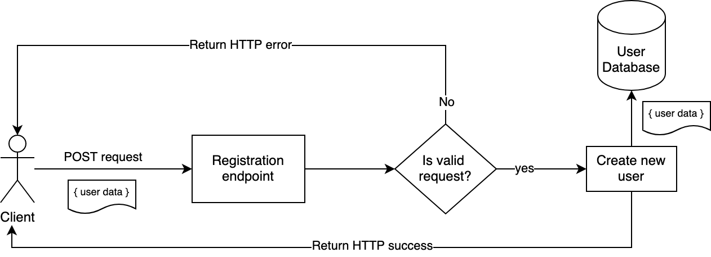

# User Registration

In order to build a multi-user application, it is essential to store and track a list of all the allowed users to the application. In addition, we should also implement authentication and authorization.
* An authentication system will prevent users to impersonate and make actions as other users.
* An authorization system will prevent users from accessing resources they are not allowed to.

## Registration implementation

In order to track the list of users, we often use a `user database`. This database will securely keep all the information about every user that is required for our application. This often includes the authentication credentials such as a password.

Here is a diagram of the general flow for user registration:



1. The client sends a HTTP post request to the backend. The body will contain all the required information to register a new user like email and password.

1. The backend reads the request and validates the request. Every application will have its own rules like password length, unique emails, etc.

1. If the request is invalid, the backend will send back an error so the client can try to register again with a valid request.

1. When the request is correct, the backend will access the user database, store the new user and return a success message.

1. Registration is now complete and we have a new user in our application!


## Example implementation
In this section we will implement a very simple registration endpoint.

First, we need a user database. The simplest solution can be defining an array inside our server:

```javascript
const usersDatabase = [];
```
In real world applications, we use a real database server like PostgreSQL or MongoDB to store all the users.

Next, lets create the endpoint:

```javascript
app.post('/register', (req, res) => {
  // Extract the information from the request body
  const newUser = { 
    username: req.body.username,
    password: req.body.password
  };
  // Check if the user is valid
  if(!isValidUser(newUser)) {
    res.status(400).send("Invalid user").end();
    return;
  }
  // Add the new user to the database
  usersDatabase.push(newUser);

  // Send HTTP 201 with the newly created user. We do not send the password!
  res.status(201).send({ username: newUser.username }).end();
});
```

Let's break down the code into parts. The first section is extracting all the information about the user from the POST request and saves it into an object.

The send step is to check if the user is valid. Invalid user object can cause problems and should not be stored in our database. The implementation of the `isValidUser` function can be as simple as this:

```javascript
const isValidUser = (user) => {
  if(!user.username || !user.password || !user.email) {
    return false;
  }
  return true;
};
```

Or you can choose to make more complicated checks like minimum password length, email validation and more. This depends on the application requirements.

If the user details are all correct, we then add the new user to the database and return success. Note the 201 HTTP status code, indicating that a new resource has been created.

And that's it! We now have a working basic registration endpoint for our users to sign up. Take the time to implement this code yourself, test it and improve it.

### User passwords
In this example, we store the user passwords in the user database as-is. This is known to be a very bad and insecure practice. We should handle user passwords with great care and do everything we can to prevent them being leaked to others. Read more in the [How to store user passwords](/node-js/storing-passwords.md) section.

## Further improvements
Here are few suggestion on how we can improve the registration endpoint:

1. Add a random user ID to the user object. You can use the popular [uuid](https://www.npmjs.com/package/uuid) library or the built-in `crypto.randomUUID()` function.
1. The User database is stored in memory. This means that if we kill the NodeJS application, the user database will be deleted. In order to fix this, save the user database into a file in a JSON format using the [File system](https://nodejs.org/api/fs.html) module.
1. Add additional checks to the `isValidUser` function. Check for the validity of the email, minimum password length, check the user database if the username has been previously registered.
1. Create HTML client with a registration form and use `fetch` to send the POST request to the server. 
1. Handle user passwords with care after reading [How to store user passwords](/node-js/storing-passwords.md)
