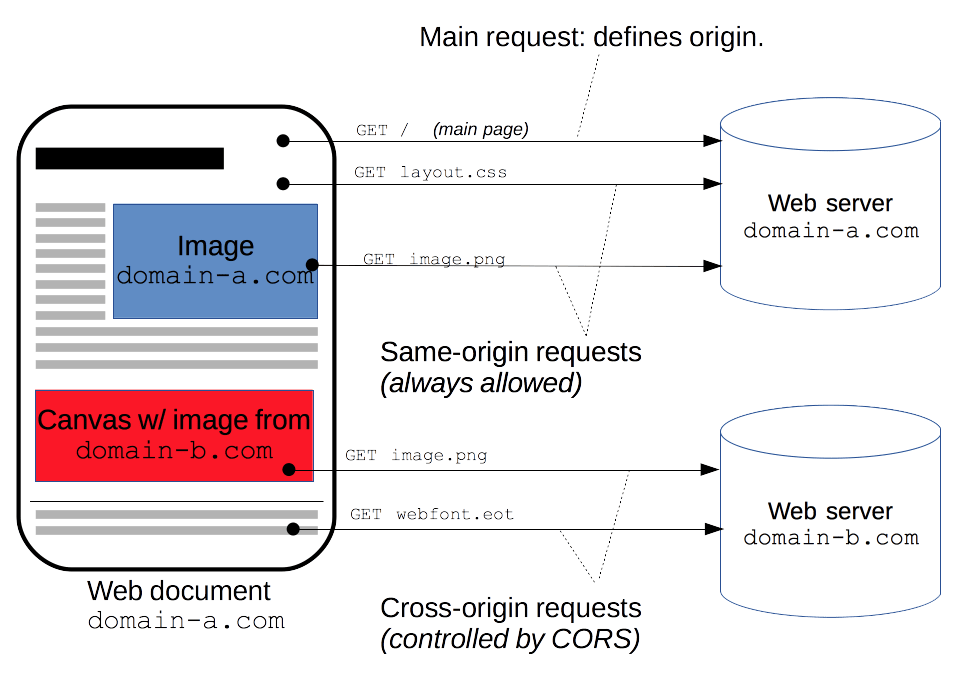

# Cross Origin Resources Sharing (CORS)

CORS stands for Cross-Origin Resource Sharing. But what is this?

As per Mozilla Developer Network (MDN) documentation:

> Cross-Origin Resource Sharing (CORS) is an HTTP-header based mechanism that allows a server to indicate any origins (domain, scheme, or port) other than its own from which a browser should permit loading resources.

While you should already be familiar with [HTTP headers](./http.md), at this point you may be asking yourself:

- What is an `origin`?
- What is this header based mechanism?
- Why do I need to know about CORS?
- How can I deal with it?

No worries, we will answer those questions in the following part.

## What is CORS ?

Let's imagine that we have an application which can be accessed at `https://my-super-application.com/index.html`. When I open the application using my Web browser, it will fetch a set of resources defined in the `html`, like a `css` file, some `js` and maybe one or two `png`. The following files are loaded without any issue:

- `https://my-super-application.com/index.html`
- `https://my-super-application.com/style.css`
- `https://my-super-application.com/script.js`
- `https://my-super-application.com/images/background.png`
- `https://my-super-application.com/images/logo.png`

The browser has no issues loading them and my application is working just fine! Now I want to rely on [fetch](https://developer.mozilla.org/en-US/docs/Web/API/Fetch_API) or [XMLHttpRequest](https://developer.mozilla.org/en-US/docs/Web/API/XMLHttpRequest) to query new resources on the web *(Note: While fetch is a more modern implementation, both ways offer similar capabilities)*.

The user does something on my page and I now need to display a new image. In the first version of the application, the image is stored at the same web site. I can use `fetch` to get the resource at `https://my-super-application.com/images/super-image.png`:

```js
async function getImage() {
  const response = await fetch("https://my-super-application.com/images/super-image.png");
  const image = await response.blob();
  displayImage(image);
}
```

It works without any issue! But now, for some reason, I want the image to come from another location or, stated more correctly, from another *origin*. For example, I want my user to see the image at `https://www.commitstrip.com/wp-content/uploads/2018/05/Strip-La-joie-du-message-derreur-english650-final.jpg`.

> Now is the right time to explain what is an [Origin](https://developer.mozilla.org/en-US/docs/Glossary/Origin) when we talk about the Web. The Web as we know it uses HTTP as its core protocol to exchange resources in a [REST](https://simple.wikipedia.org/wiki/Representational_state_transfer) fashion. Each resource is identified by its [URL](https://developer.mozilla.org/en-US/docs/Glossary/URL). The [Origin](https://developer.mozilla.org/en-US/docs/Glossary/Origin) is defined by the **scheme** (protocol), **hostname** (domain), and **port** of the URL used to access it. Two resources have the same origin only when the **scheme**, **hostname**, and **port** all match.
>
> 

As we can see the origin of the new image (`https://www.commitstrip.com`) is different compared to my original application origin (`https://my-super-application.com`).  It means that I'm requesting a resource from a different origin and therefore making a **cross-origin request**.



Back to my application, when requesting `https://www.commitstrip.com/wp-content/uploads/2018/05/Strip-La-joie-du-message-derreur-english650-final.jpg`. On the origin server, CORS is not configured to allow me to access the resource from my website. I'm blocked and I get the following error:


## Why CORS?

But why do we need CORS and why can't I access resource from any Origin? This is because browsers want to protect users from [CSRF](https://developer.mozilla.org/en-US/docs/Glossary/CSRF) attacks!

Let's imagine that you are authenticated with your bank website at `my-bank.com`. An attacker could make you visit their website. Once there, they could make requests to `my-bank.com` on your behalf using the authenticated session stored in your browser, and transfer money to another account. The [Same-Origin Policy](https://developer.mozilla.org/en-US/docs/Web/Security/Same-origin_policy?ea-publisher=javadecompilerscom) enforced by your browser protects users from this kind of attack!

Without [CORS](https://developer.mozilla.org/en-US/docs/Web/HTTP/CORS) and because of the [Same-Origin Policy](https://developer.mozilla.org/en-US/docs/Web/Security/Same-origin_policy?ea-publisher=javadecompilerscom), we wouldn't be able to load resource from 3rd Party websites and APIs making the web less vibrant 😿.

Thanks to CORS, the browser and the web server are able to exchange headers (prefixed with `Access-Control-*`) defining if the resource can be consumed from the application's origin in a more secure and controlled manner.

## How should I work with CORS?

**At this stage, you SHOULD not worry about CORS configuration and complexity!**

It is good for you to know what it is and why it exists as you may face it in the future. But in most of the cases, libraries and frameworks will take care of that for you!

Also, most of the Public APIs you will find will allow any Origin to request it! If it is not the case, you should move to another API.

> ❗ Be aware that CORS only apply to requests sent by a web browser to a web server. Request between web servers do not take CORS into consideration ❗

# Extra reading

If you just can't get enough, here are some extra links that mentors/students have found useful concerning this topic:

- [Enable CORS](https://enable-cors.org/index.html) if you want to jump into the history of CORS
- [MDN Documentation regarding CORS](https://developer.mozilla.org/en-US/docs/Web/HTTP/CORS) a strong reference for explaining and understanding cors
- [CORS Specification](https://fetch.spec.whatwg.org/#http-cors-protocol) if you want to dive in how CORS works
