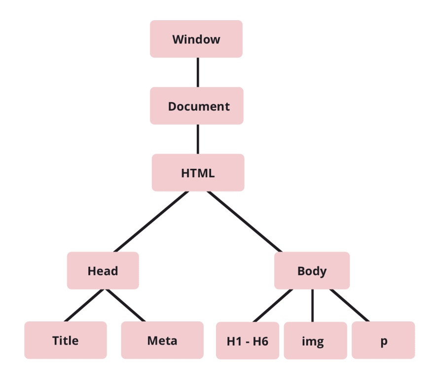

# What is the Document-Object Model (DOM)?

Every browser uses the Document-Object Model to build up a website. In this arcticle we will go over what this is and why it is used. First we will need to introduce the connection with JavaScript and the browser. 

### JavaScript and the browser

As we've learned in the previous module, JavaScript is a programming language. It allows you to write logical rules that the computer can execute in order to solve a problem. However, saying that the 'computer' executes it is actually inaccurate. It is actually **the browser** that executes the code.

The browser is software that has been build to understand JavaScript ((and HTML/CSS)). Each different browser (Chrome, Firefox, Safari, etc.) has, behind the scenes, a **JavaScript engine** that works to transform the JavaScript code that you write into code that the computer understands.



Every programming language sits at a certain level of abstraction, relative to the only real language a computer understands: machine code (which is only 0's and 1's). For more information on this, check out the following [video](https://www.youtube.com/watch?v=bUWCD45qniA)

For our purposes, it's only important to understand that the browser looks at JavaScript and then does what it's instructed to do: add elements, modify text or media files, etc. That's the purpose of JavaScript in the browser: to add interactivity based off of the user's behavior.



### The DOM

The Document-Object Model (DOM) is a tree-like representation of the structure of a webpage. The following is a simple example:

JavaScript is made accessible to the DOM by embedding it into an HTML file. You might've seen the `` before; well, this is how the browser becomes aware of JavaScript.

### The Critical Rendering Path

The actual process of transforming HTML, CSS and JavaScript into a user-viewable version of a webpage is called **the Critical Rendering Path**. There is a great explanation about this that we cannot improve on [here](https://bitsofco.de/understanding-the-critical-rendering-path/)

# Extra reading
If you just can't get enough, here are some extra links that mentors/students have found useful concerning this topic:

- [What exactly is the DOM](https://bitsofco.de/what-exactly-is-the-dom/)
- [JavaScript and the browser](https://eloquentjavascript.net/13_browser.html)
- [JavaScript DOM Crash Course - Part 1](https://www.youtube.com/watch?v=0ik6X4DJKCc)